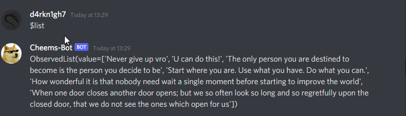
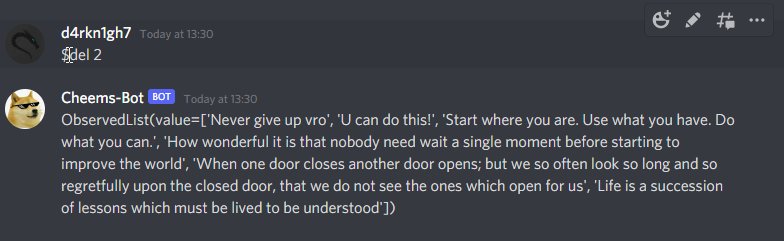

# Cheems-Bot -> A Discord bot coded in Python

This is bot has the following features :

1. Encourages with inspiring quotes by famous personalities using "$inspire" command
2. Using "$covid 'country name here' " you can retrieve the latest covid related information about that particular country.
3. Using "$qoute" command you can get read some of the coolest quotes written by people from all over the world
4. Using "$joke" command you can read funny jokes
5. Use "$new 'encouraging message here' " command to add a encouraging message to the database
6. Use "$list" to list the encouraging messages in database
7. Use "del" to delete a particular encouraging message added by you
8. This bot has a unique feature of detecting sad words and replying to it. You can turn this on or off  using "$ responding true or "$responding false"

Some sample pictures : 
 ## Inspirational Quotes:

## Covid Information:

## Cool Quotes by Random People:

## Funny Random Jokes ! :

## Adding Custom Encouraging Msgs:

## List the Custom Encouraging Msgs:

## Delete the Custom Encouraging Msgs:

